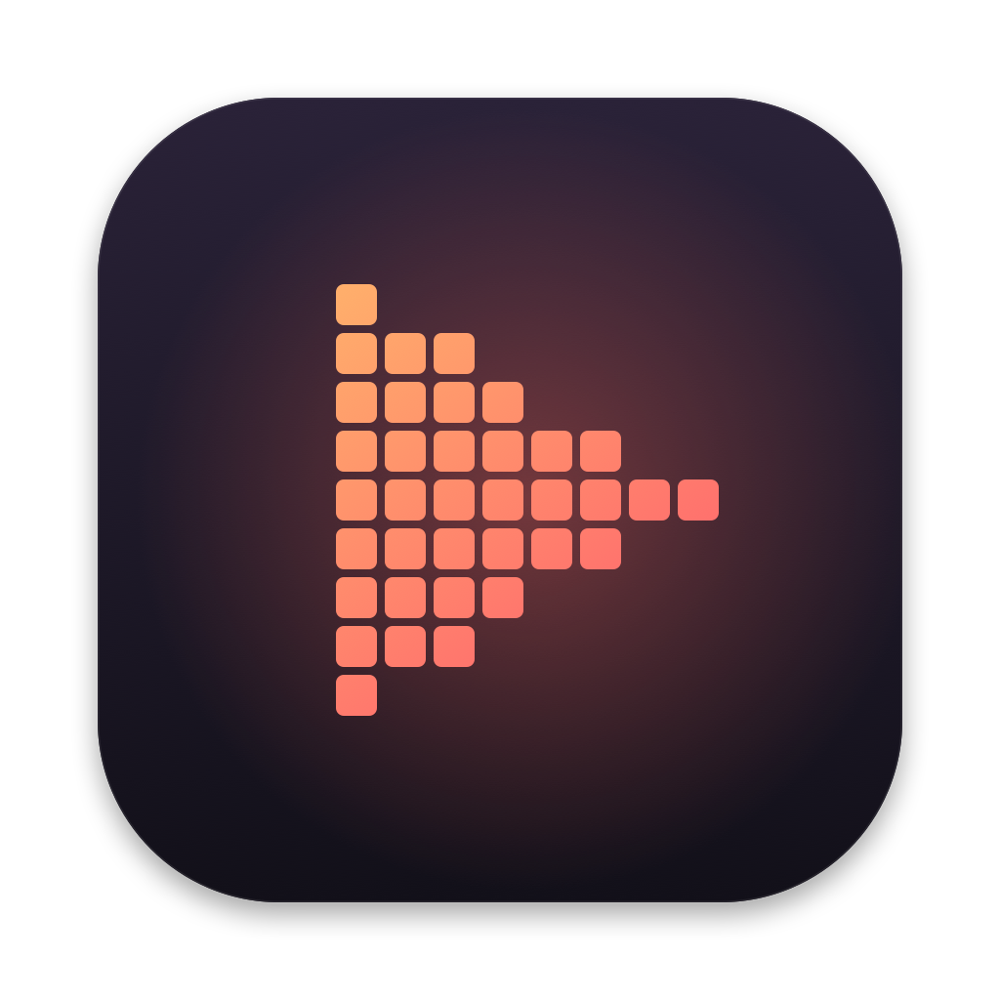

<p align="center">
  
</p>

<h1 align="center">Ursprung</h1>

<p align="center">
  A native retro game library for macOS — organise your games, see their covers and stories, and play them with one click.<br>
  Built with SwiftUI and Metal on Apple Silicon, powered by <a href="https://www.libretro.com">libretro</a>, with metadata from <a href="https://www.screenscraper.fr">ScreenScraper</a>.
</p>

<p align="center">
  <a href="LICENSE"></a>
  
  
</p>

---

> **Status:** early development (0.1). The core experience — library, metadata,
> playing, save states, controllers — works. Expect rough edges.

## Features

- **A library, not a file browser.** Point Ursprung at your game folders; it
  identifies the system of every game from file types and folder names, hides
  disc track files, and keeps the library in sync when files change.
- **Covers and details from ScreenScraper.** Box art, screenshots, fan art,
  logos, descriptions, developer, publisher, genre, release date and rating —
  in your language and region (e.g. German titles and box art).
- **Native and fast.** SwiftUI interface with the macOS 26 design language,
  Metal presentation, audio-synchronised frame pacing, OpenGL support for 3D
  cores (N64, PSP, Dreamcast).
- **libretro cores on demand.** The right core is downloaded automatically from
  the libretro buildbot the first time you start a game — nothing to configure.
- **Save states with thumbnails**, quick save/load, battery saves, fast forward,
  multi-disc games, per-core options.
- **Controllers and keyboard.** Xbox, PlayStation, Switch Pro and MFi
  controllers via the GameController framework, Xbox 360 protocol (XInput)
  pads and receivers over USB (e.g. 8BitDo 2.4 GHz dongles) and other
  USB/Bluetooth gamepads with remappable buttons via IOKit (up to four
  players), freely remappable keyboard, mouse as touch screen / pointer
  (Nintendo DS).
- **BIOS management.** Drop BIOS files in and Ursprung recognises them by
  checksum and names them the way each core expects.
- **English and German** user interface.

## Supported systems

NES · Famicom Disk System · SNES · Nintendo 64 · Game Boy · Game Boy Color ·
Game Boy Advance · Nintendo DS · Virtual Boy · Pokémon mini · SG-1000 ·
Master System · Mega Drive / Genesis · Mega-CD / Sega CD · 32X · Game Gear ·
Saturn · Dreamcast · PlayStation · PSP · PC Engine / TurboGrafx-16 ·
PC Engine CD · SuperGrafx · Atari 2600 / 5200 / 7800 · Lynx · Jaguar ·
Neo Geo Pocket (Color) · WonderSwan (Color) · ColecoVision · Intellivision ·
Vectrex · 3DO · MSX · Arcade (FinalBurn Neo, MAME 2003-Plus) · GameCube / Wii
(experimental)

See [docs/SUPPORTED_SYSTEMS.md](docs/SUPPORTED_SYSTEMS.md) for file types, folder
names, cores and BIOS requirements per system.

## Requirements

- macOS 26 (Tahoe) or later
- A Mac with Apple Silicon
- Xcode 26 or later and [XcodeGen](https://github.com/yonaskolb/XcodeGen) to build

## Building

```sh
brew install xcodegen
git clone https://github.com/bhuaysan/ursprung.git
cd ursprung
cp .env.example .env        # optional: add ScreenScraper developer credentials
make project                # generates Ursprung.xcodeproj
open Ursprung.xcodeproj     # then press ⌘R
```

Or entirely from the command line: `make run`. Other targets: `make test`,
`make release`, `make smoke` (headless core test), see the [Makefile](Makefile).

### ScreenScraper credentials

ScreenScraper requires *developer* credentials for every API client. They are
**not** part of this repository. Request your own developer access via the
[ScreenScraper](https://www.screenscraper.fr/) forum, put the credentials into
`.env` and rebuild — the build script embeds them in the app. Without them Ursprung works normally, it just can't fetch metadata.

Players can optionally enter their personal ScreenScraper account in
**Settings → Metadata** for a higher daily quota. Details:
[docs/METADATA.md](docs/METADATA.md).

## Getting started

1. Launch Ursprung and click **Add Folder…** — choose the folder with your games.
2. Sort games into sub folders named after the system (`SNES`, `PSX`, `Mega Drive`,
   `Arcade`, …). Cartridge games are recognised by file type anyway; for disc
   images (`.cue`, `.chd`, `.iso`) and archives the folder name decides.
3. Metadata and covers are fetched automatically. Double-click a game to play.
4. For systems that need a BIOS (PlayStation is optional, Sega CD, Saturn, PC
   Engine CD, Lynx … are required) open **Settings → BIOS** and drop the files in.
   See [docs/BIOS.md](docs/BIOS.md).

### Default keyboard layout

| RetroPad | Key | RetroPad | Key |
|---|---|---|---|
| D-pad | Arrow keys | Start / Select | Return / Right Shift |
| A / B | X / Z | X / Y | S / A |
| L / R | Q / W | L2 / R2 | E / R |
| L3 / R3 | 1 / 2 | Left stick | I J K L |
| Right stick | T F G H | | |

**Esc** opens the game menu, hold **Space** to fast forward, **F2 / F4** quick
save / load, **⌘S / ⌘L** likewise from the menu bar, **⌃⌘F** full screen. All
RetroPad keys can be changed in **Settings → Controls**.

## Your data

Everything lives in `~/Library/Application Support/Ursprung/`:

| Folder | Contents |
|---|---|
| `Library.store` | The library database. If it cannot be opened, Ursprung asks before moving it to `Library.store-backup-<date>/`; it is never deleted automatically |
| `Cores/` | Downloaded libretro cores |
| `System/` | BIOS files and core assets (the libretro system directory) |
| `Saves/<system>/<game-id>/` | Battery saves (`.srm`), one folder per game. Memory cards and other core saves live in `Saves/<system>/` |
| `States/<game>/` | Save states and their thumbnails |
| `Media/<game>/` | Artwork from ScreenScraper |

Your game files are only ever read, never modified.

## Legal

Ursprung is an emulator frontend. It contains **no games, BIOS files or
copyrighted system software**, and it does not help you obtain them. Only use
games and BIOS files you have dumped from media and hardware you own.

The libretro cores are independent projects under their own licenses (GPL,
LGPL, MIT, and some non-commercial ones). They are downloaded from the libretro
buildbot at runtime and are not distributed with Ursprung.

Box art and other media are provided by ScreenScraper and its contributors.

## Contributing

Contributions are very welcome — see [CONTRIBUTING.md](CONTRIBUTING.md) and the
[architecture overview](docs/ARCHITECTURE.md). Please follow the
[Code of Conduct](CODE_OF_CONDUCT.md). Security issues: [SECURITY.md](SECURITY.md).

## License

Copyright © 2026 Ursprung contributors.

Ursprung is free software: you can redistribute it and/or modify it under the
terms of the [GNU General Public License](LICENSE) as published by the Free
Software Foundation, either version 3 of the License, or (at your option) any
later version.

`Ursprung/Bridge/libretro.h` is © The RetroArch team, MIT licensed.

## Acknowledgements

- [libretro](https://www.libretro.com) and all core authors
- [ScreenScraper](https://www.screenscraper.fr) and its community of contributors
- [OpenEmu](https://openemu.org), for showing how good an emulator frontend on the Mac can be
